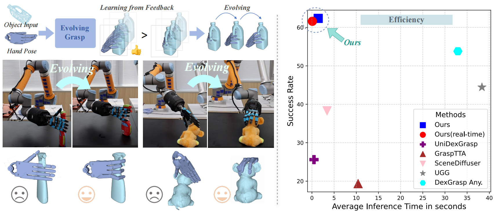
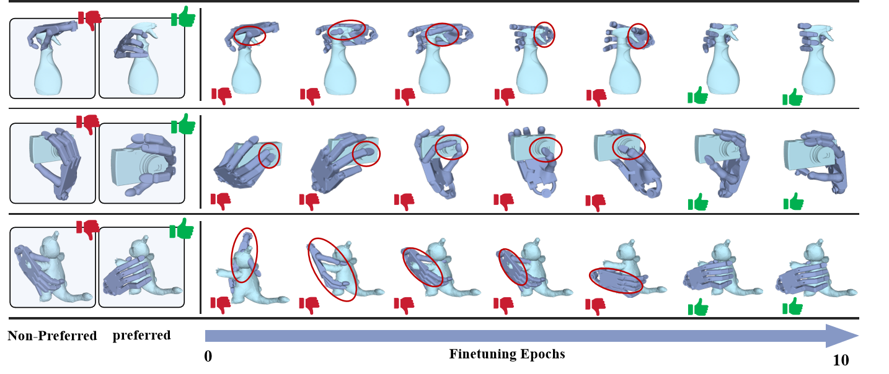
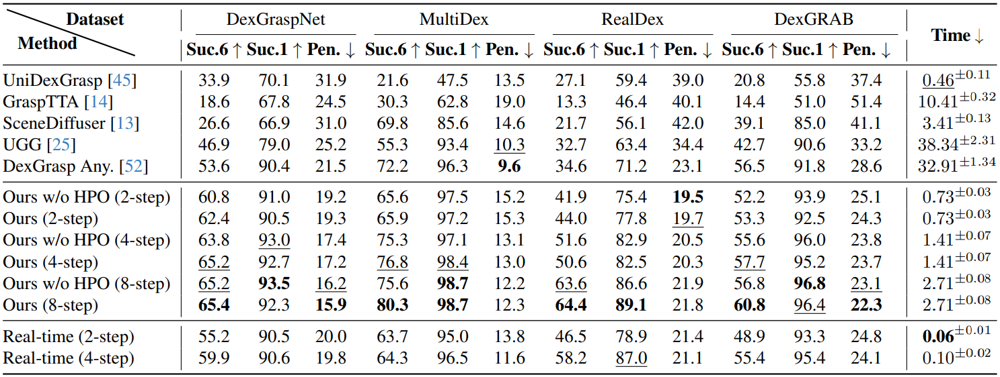

 <!-- <br> -->
<!-- <p align="center"> -->
<h1 align="center"><strong>EvolvingGrasp: Evolutionary Grasp Generation via Efficient Preference Alignment
</strong></h1>
  <p align="center">
      <strong><span style="color: red;">ICCV 2025</span></strong>
    <br>
   <a href='https://github.com/csyufei' target='_blank'>Yufei Zhu*<sup>1</sup></a>&emsp;
   <a href='https://ymzhong66.github.io/' target='_blank'>Yiming Zhong*<sup>1</sup></a>&emsp;
   <a href='https://yizhifengyeyzm.github.io/' target='_blank'>Zemin Yang<sup>1</sup></a>&emsp;
   <a href='https://coralemon.github.io/' target='_blank'>Peishan Cong<sup>1</sup></a>&emsp;
   <a href='https://faculty.sist.shanghaitech.edu.cn/yujingyi' target='_blank'>Jingyi Yu<sup>1</sup></a>&emsp;
   <a href='https://xingezhu.me/' target='_blank'>Xinge Zhu<sup>2</sup></a>&emsp;
   <a href='https://yuexinma.me' target='_blank'>Yuexin Ma<sup>1</sup></a>&emsp;
    <br>
    <sup>1</sup>ShanghaiTech University&emsp;
    <sup>2</sup>Chinese University of Hong Kong    
    <br>
    *Indicates Equal Contribution
    <br>
  </p>
</p>

  
<p align="center">
  <a href='https://arxiv.org/pdf/2503.14329'>
    </a>
  <a href='https://evolvinggrasp.github.io/'>
    </a>
</p>

<!-- <p align="center">
  <a href="https://evolvinggrasp.github.io/"><b>📖 Project Page</b></a> |
  <a href="https://arxiv.org/pdf/2503.14329"><b>📄 Paper Link</b></a> |
</p> -->

</div>

>  We propose EvolvingGrasp, an evolutionary grasp generation method that continuously enhances grasping performance through efficient preference alignment.

<div align="center">
    
</div>

## 📣 News
- [6/26/2025] EvolvingGrasp has been accepted by ICCV 2025!!!🎉🎉🎉
- [3/19/2025] The paper has been released.

## 🚩 Plan
- [x] Release Paper.
- [ ] Release Source Code.
- [ ] Release Checkpoints in different datasets.

## 😲 Results
>  Evolution of robotic grasp preferences during efficient feedback-driven finetuning across 10 epochs.
<div align="center">
    
</div>
<!-- <div align="center">
    
</div> -->

<!-- Please refer to our [homepage](https://evolvinggrasp.github.io/) for more thrilling results! -->

# 📚 Datasets

<!-- In our data processing, the rotation and translation formula is \( Y = a(x + b) \), where \( Y \) represents the shadow hand after rotation and translation, and \( x \) is the original hand. It is important to emphasize that we use \( Y = a(x + b) \) rather than \( Y = ax + b \). This formulation allows us to conveniently transfer the rotation to the object, i.e., \(O = a^T * O \), enabling more flexible manipulation.

| **Datasets** | **Huggingface link** | **Google drive Link (Format Compatible with Our Dataloader)** | **Paper** |
|:---:|:---:|:---:|:---:|
| **DGA** | [Huggingface](https://huggingface.co/datasets/GaussionZhong/DexGrasp-Anything/resolve/main/Dexgraspanyting.tar.gz) | [Datasets](https://drive.google.com/file/d/1of-m2qxVqgWf-nHV6oVHPk1z4NWVrEPV/view?usp=drive_link) | ✅[DexGrasp Anything: Towards Universal Robotic Dexterous Grasping with Physics Awareness](https://arxiv.org/pdf/2503.08257) |
| *Realdex*           | [Huggingface](https://huggingface.co/datasets/GaussionZhong/DexGrasp-Anything/resolve/main/Realdex.zip) | [Datasets](https://drive.google.com/file/d/12rgyyKg07PmY6jzl7pMocA4o5ikLFuOA/view)                     | ✅[RealDex: Towards Human-like Grasping for Robotic Dexterous Hand](https://arxiv.org/abs/2402.13853)                                                    |
| *DexGraspNet*          | [Huggingface](https://huggingface.co/datasets/GaussionZhong/DexGrasp-Anything/resolve/main/DexGraspNet.zip) | [Datasets](https://drive.google.com/file/d/1FHJxEDl2jegOpq-g4KZ4eEVvM3gqDQCh/view)                     | ✅[DexGraspNet: A Large-Scale Robotic Dexterous Grasp Dataset for General Objects Based on Simulation](https://arxiv.org/abs/2210.02697)                                                    |
| *UniDexGrasp*           | [Huggingface](https://huggingface.co/datasets/GaussionZhong/DexGrasp-Anything/resolve/main/UniDexGrasp.zip) | [Datasets](https://drive.google.com/file/d/1-nPUP14x0VOfIqQwYU-hc-WhUaPBxEQ7/view)                     | ✅[UniDexGrasp: Universal Robotic Dexterous Grasping via Learning Diverse Proposal Generation and Goal-Conditioned Policy](https://arxiv.org/abs/2303.00938)                                                    |
| *MultiDex*             | [Huggingface](https://huggingface.co/datasets/GaussionZhong/DexGrasp-Anything/resolve/main/MultiDex_UR.zip) | [Datasets](https://drive.google.com/file/d/1wHdWLfvxWjpFBV_Ld-j4DwNXAr1UMERf/view)                     | ✅[GenDexGrasp: Generalizable Dexterous Grasping](https://arxiv.org/abs/2210.00722)                                                    |
| *DexGRAB(Retargeting from Grab)*            | [Huggingface](https://huggingface.co/datasets/GaussionZhong/DexGrasp-Anything/resolve/main/DexGRAB.zip) | [Datasets](https://drive.google.com/file/d/1Xmgw-c3lrkab2NIs_1i0Hq95I0Y4Sp8n/view)                     | ✅[Grab: A dataset of whole-body human grasping of objects.](https://arxiv.org/abs/2008.11200)                                                    | -->

<!-- # 🦾 Make your own dataset
- First, your dataset should contain mesh files of objects. You can create an `object_pcds_nors.pkl` file by sampling point clouds from these meshes. Modify the paths in `Process_your_dataset/make_obj_pcds.py` to build your dataset.
    ```bash
    python Process_your_dataset/make_obj_pcds.py
    ```
- Based on your data pose format (such as translation, rotation, qpose, scale), `create a corresponding .pt file`. You can refer to the input examples in the datasets folder to build it. You need to understand the pose format of your dataset. Pay special attention to whether the translation, rotation, and scale are applied to the object point cloud or to the robotic hand. You can also modify your dataloader to ensure that the input poses and object point cloud data visualize correctly.

- During the testing phase, you need to generate a URDF file for all meshes. You can use `Process_your_dataset/make_obj_urdf.py` to generate them (recommended to place in the same directory level as the mesh files).
    ```bash
    python Process_your_dataset/make_obj_urdf.py
    ``` -->

## 🛠️ Setup
- 1. Create a new `conda` environemnt and activate it.（My CUDA version (nvcc --version) is 11.7）

    ```bash
    conda create -n DGA python=3.8
    conda activate DGA
    pip install torch==1.11.0+cu113 torchvision==0.12.0+cu113 --extra-index-url https://download.pytorch.org/whl/cu113
    ```

- 2. Install the required packages.
    You can change TORCH_CUDA_ARCH_LIST according to your GPU architecture.
    ```bash
    TORCH_CUDA_ARCH_LIST="7.0;7.5;8.0;8.6" pip install -r requirements.txt
    ```
    Please install in an environment with a GPU, otherwise it will error.
    ```bash
    cd src
    git clone https://github.com/wrc042/CSDF.git
    cd CSDF
    pip install -e .
    cd ..
    git clone https://github.com/facebookresearch/pytorch3d.git
    cd pytorch3d
    git checkout tags/v0.7.2  
    FORCE_CUDA=1  TORCH_CUDA_ARCH_LIST="7.5;8.0;8.6"  python setup.py install
    cd ..
    ```
- 3. Install the Isaac Gym
    Follow the [official installation guide](https://developer.nvidia.com/isaac-gym) to install Isaac Gym and its dependencies.
    You will get a folder named `IsaacGym_Preview_4_Package.tar.gz` put it in ./src/IsaacGym_Preview_4_Package.tar.gz
    ```bash
    tar -xzvf IsaacGym_Preview_4_Package.tar.gz
    cd isaacgym/python
    pip install -e .
    ```

Before training and testing, please ensure that you set the dataset path, model size, whether to use LLM, sampling method, and other parameters in `configs`.

### Train

<!-- - Train with a single GPU

    ```bash
    bash scripts/grasp_gen_ur/train.sh ${EXP_NAME}
    ```

- Train with multiple GPUs

    ```bash
    bash scripts/grasp_gen_ur/train_ddm.sh ${EXP_NAME}
    ``` -->

### Sample

<!-- ```bash
bash scripts/grasp_gen_ur/sample.sh ${exp_dir} [OPT]
# e.g., Running without Physics-Guided Sampling:   bash scripts/grasp_gen_ur/sample.sh /outputs/exp_dir [OPT]
# e.g., Running with Physics-Guided Sampling:   bash scripts/grasp_gen_ur/sample.sh /outputs/exp_dir OPT
```
- `[OPT]` is an optional parameter for Physics-Guided Sampling. -->

### Test 

<!-- First, you need to run `scripts/grasp_gen_ur/sample.sh` to sample some results. 
You also need to set the dataset file paths in `/envs/tasks/grasp_test_force_shadowhand.py` and /scripts/grasp_gen_ur/test.py`. 
Then, we will compute quantitative metrics using these sampled results.

```bash
bash scripts/grasp_gen_ur/test.sh ${EVAL_DIR} 
# e.g., bash scripts/grasp_gen_ur/test.sh  /outputs/exp_dir/eval/final/2025-03-16_19-15-31
``` -->

##  Checkpoints
<!-- | DexGrasp Anything(W/o LLM)                   | Huggingface Link | Google drive Link |
|------------------------------------------------------------------------|---------|---------|
| *Realdex*  |[Huggingface](https://huggingface.co/GaussionZhong/Dexgraspanyting/resolve/main/Realdex.pth)| [CKPT](https://drive.google.com/drive/folders/1_Nnj73l88__2i5_ek1sE8aujvAqvmpZw)    |
| *DexGraspNet*  | [Huggingface](https://huggingface.co/GaussionZhong/Dexgraspanyting/resolve/main/DexGraspNet.pth)|[CKPT](https://drive.google.com/drive/folders/1Yfc9X-V21gv4YRmrD8KeMMARaHDNIBrZ)    |
| *UniDexGrasp*   | [Huggingface](https://huggingface.co/GaussionZhong/Dexgraspanyting/resolve/main/UniDexGrasp.pth)|[CKPT](https://drive.google.com/drive/folders/16a5JfyBqe1f1BjTOxvLOujCU-vQKjv5b)    |
| *MultiDex*   | [Huggingface](https://huggingface.co/GaussionZhong/Dexgraspanyting/resolve/main/MultiDex.pth)|[CKPT](https://drive.google.com/drive/folders/1RAFqmc0OeMGt4g6vV2Aa5g4igySlsM30)    |
| *DexGRAB*   | [Huggingface](https://huggingface.co/GaussionZhong/Dexgraspanyting/resolve/main/DexGRAB.pth)|[CKPT](https://drive.google.com/drive/folders/1kva1FviOM59d3zbJ2Jyj8Ohvz8AWI8AT)    | -->

<!-- --- -->


## 🎫 License

For academic use, this project is licensed under [the 2-clause BSD License](https://opensource.org/license/bsd-2-clause). 

## 💓 Acknowledgement

We would like to acknowledge that some codes and datasets are borrowed from [Scene-Diffuser](https://github.com/scenediffuser/Scene-Diffuser), [UGG](https://github.com/Jiaxin-Lu/ugg), [DexGrasp Anything](https://github.com/4DVLab/DexGrasp-Anything/). We appreciate the authors for their great contributions to the community and for open-sourcing their code and datasets.

## 🖊️ Citation
If you find our work helpful, please cite:
```
@article{zhu2025evolvinggrasp,
  title={Evolvinggrasp: Evolutionary grasp generation via efficient preference alignment},
  author={Zhu, Yufei and Zhong, Yiming and Yang, Zemin and Cong, Peishan and Yu, Jingyi and Zhu, Xinge and Ma, Yuexin},
  journal={arXiv preprint arXiv:2503.14329},
  year={2025}
}
``` 
Please also consider citing the following papers that inspired EvolvingGrasp.
```
@inproceedings{motionlcm,
  title={Motionlcm: Real-time controllable motion generation via latent consistency model},
  author={Dai, Wenxun and Chen, Ling-Hao and Wang, Jingbo and Liu, Jinpeng and Dai, Bo and Tang, Yansong},
  booktitle={ECCV},
  pages={390--408},
  year={2025}
}
@article{zhong2025dexgrasp,
  title={DexGrasp Anything: Towards Universal Robotic Dexterous Grasping with Physics Awareness},
  author={Zhong, Yiming and Jiang, Qi and Yu, Jingyi and Ma, Yuexin},
  journal={arXiv preprint arXiv:2503.08257},
  year={2025}
}
``` 
